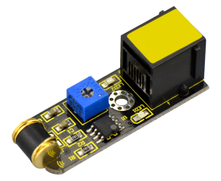

# A35-Sensor de vibración
Se trata de un sensor digital que cuando se somete a vibración cambia su estado de salida. El módulo detector de vibración consta de un resorte y un poste conductor central que, ante golpes y vibraciones, el resorte reacciona desplazándose de su centro y cerrando el circuito. El módulo dispone de un potenciómetro para ajustar su sensibilidad.

A pesar de la simplicidad, se puede aprovechar para contar pasos, alarma de advertencia de colisión, etc. Su aspecto lo vemos en la Figura A35.1.

*Figura A35.1. Aspecto*

En el apartado de bloques de programación, se encuentra en "Sensores" (Figura A34.2).

*Figura A35.2. Bloques*

## **Práctica A35.1**
Vamos a montar un sistema que cuando acerquemos un imán se encienda un diodo LED.

* Implementar un programa que haga funcionar al relé reed como detector magnético en una supuesta puerta de un armario. Cuando la puerta está cerrada se detecta el campo magnético y el diodo LED está apagado y cuando se abre este debe apagarse. El programa lo tenemos en la Figura A34.3.

*Figura A35.3. Solución A35.1*

