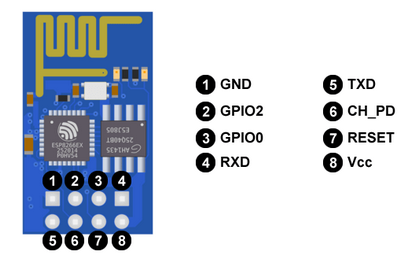
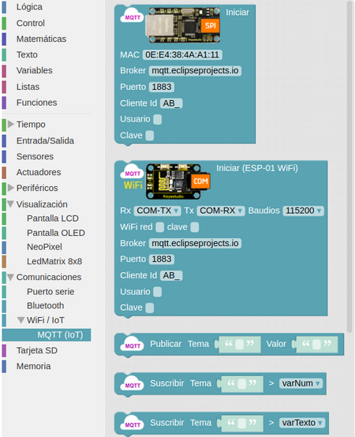

# A38-Módulo WiFi mas ESP01
En Easy Plug no existe como tal el módulo ESP-01 basado en el microcontrolador ESP8266 que permite realizar comunicaciones vía WiFi. Pero para facilitar la conexión de este módulo a la placa si se dispone de un zócalo que facilita su montaje.

En este apartado vamos a hablar de como enviar datos a la nube, empezando así a trabajar el Internet de las Cosas.  La idea aquí no es profundizar en conceptos técnicos como Broker, MQTT, Mosquitto, etc. Pero si que vamos a iniciarnos en el tema IoT.

## **IoT básico**

### ¿Qué es la Internet de las Cosas?
La expresión “Internet de las cosas” o IoT (del inglés, Internet of Things), internet de todas las cosas o internet en las cosas, hace referencia al uso que hacen de Internet los dispositivos conectados (las cosas) para comunicarse sin intervención humana directa.  También se usa el término IoT para referirse al conjunto de estos dispositivos conectados comunicando “entre máquinas” (M2M) sin requerir interacción humana. No existe una Internet especial o diferente para “las cosas”, en principio, se opera con las mismas redes que en otros usos de Internet. En la Figura A38.1 se grafica la conexión de elementos con la nube a través de la red.

*Figura A38.1. Conexión de elementos con la nube*

El IoT sirve para monitorización y control electrónico y toma de decisiones inteligente. Es decir, conectar dispositivos a Internet permite enviar y recibir información usando una infraestructura global y así poder monitorizar y/o controlar automáticamente y a distancia multitud de contextos. Por ejemplo, en entornos urbanos (ciudades inteligentes) se puede conocer la actividad humana, del medio ambiente, del tráfico… tanto para informar de su estado (como las plazas de aparcamiento disponibles, la densidad o velocidad de la circulación, la contaminación…) como para tomar decisiones de forma manual o automática para optimizar los recursos disponibles (iluminación, riego de jardines, funcionamiento de los semáforos…).

Para conectar a la red las placas Arduino, sus clones o basadas en el mismo se usan los módulos ESP8266. El ESP8266 es un chip de bajo costo WiFi que contiene su propio microcontrolador, un Tensilica L106 de 32-bit. Es un chip de bajo bajo coste y reducido tamaño.

El chip ESP8266 forma parte de multitud de módulos comerciales a través de diferentes soluciones con distintas funciones, pines, tamaños y precios. El más simple es el ESP-01, que solo dispone de 2 puertos digitales y necesita un adaptador USB para poder ser programado y es el que vamos a usar aquí. En la Figura A38.2 vemos los distintos módulos ESP.

*Figura A38.2. Módulos ESP*

Hay otros muchos sistemas como por ejemplo ESP-12E de ESP8266, la placa de desarrollo NodeMCU, también basada en el ESP-12E, Además, hay placas con WiFi que usan otros chip WiFi diferentes, como la Arduino MKR1000. En la Figura A38.3 vemos estos módulos.

*Figura A38.3. Otros módulos ESP*

Un modelo destacable es la placa ESP32 STEAMakers basada en la CPU de dos núcleos Xtensa LX6 con arquitectura de 32 bits y una frecuencia de trabajo de 160 MHz que integra tarjeta microSD, comunicaciones WiFi y Bluetooth y tiene el formato de un Arduino UNO. En la Figura A38.4 vemos el aspecto de esta tarjeta.

*Figura A38.4. ESP32 STEAMakers*

### Introducción al módulo ESP8266 ESP-01
El módulo WiFi ESP-01 es uno de las más populares y económicos, pese a no ser el más potente ni versátil. El ESP-01 trae instalado una versión de firmware con la que podemos comunicarnos con el ESP8266 mediante comandos AT (los veremos a continuación) a través del puerto serie. Este tipo de comunicación nos va a permitir crear un puente entre la placa de control del proyecto y el ESP8266, consiguiendo así conectar a una red WiFi y dar un primer paso de gigantes en el mundo IoT.

El aspecto del ESP-01 lo tenemos en la Figura A38.5 y junto al mismo vemos sus principales características.

| Figura A38.5. Aspecto ESP-01 | Características |
|:-:|---|
||- ESP8266 es el microcontrolador del módulo ESP-01  - La memoria flash es la BG25Q80A  - Los LEDs informan de si está encendido o no y de la transmisión de datos (Tx y Rx)  - La antena WiFi para la conexión a una internet  - Los pines permiten conectar alimentación, sensores, …   Toda la información en el [datasheet](https://docs.google.com/viewer?url=http%3A%2F%2Fwww.microchip.ua%2Fwireless%2Fesp01.pdf) del fabricante   |

Los pines están distribuidos de la siguiente forma:

| Pines ESP-01 | Descripción |Fuente: https://programarfacil.com |
|:-:|---|---|
||1 - GND 2 - Pin digital número 2  3 - Pin digital número 0  4 - RXD es el pin por donde se van a recibir los datos del puerto serie. Trabaja a 3,3 V. También puede ser el pin digital GPIO3  5 - TXD es el pin por donde se van a transmitir los datos del puerto serie. Trabaja a 3,3 V. También puede ser el pin digital GPIO1 |6 - CH_PD es el pin para apagar y encender el ESP-01: si lo ponemos a 0 V (LOW) se apaga, y a 3,3 V (HIGH) se enciende. 7 - RESET pin a 0V resetea el ESP-01  - Vcc es el pin de alimentación. Funciona a 3,3V y admite un máximo de 3,6 V. La corriente suministrada debe ser mayor que 200 mA. |

GPIO (del inglés, General Purpose Input Output) son entradas o salidas de propósito general, o sea pines digitales.

El ESP-01 soporta comunicación I2C, por lo que, pese a tener solo un par de GPIOs, podemos conectarle multitud de sensores y actuadores a través del mencionado bus de datos I2C.

### Programación del módulo ESP8266 ESP-01
El ESP-01 dispone de un microcontrolador y una memoria donde poder almacenar programas, luego es un dispositivo programable en si mismo. Cargar programas en el dispositivo es algo mas complejo de lo que hemos visto hasta ahora dado que tiene dos modos de operación, el modo flash o de ejecución y el modo UART o de grabación y debemos ser nosotros quienes activemos un modo u otro, cosa que hasta ahora el entorno ArduinoBlocks ha sido el encargado de hacerlo.  Los modos de operación se configuran a través de los puertos GPIO0 y GPIO2.

Para programar el ESP-01 hay que usar los pines Rx y Tx para transmitir los datos a la memoria Flash, donde se almacenará el sketch o programa.

En las placas de control los pines  Rx y Tx están en los pines D0 y D1 respectivamente y también son los que se utilizan para cargar programas a una velocidad de 115200 baudios, así que si estos pines los ocupamos con el ESP8266 no podremos cargar programas en nuestra placa. Ahora bien, es posible utilizar otros pines para usar WiFi y evitar este problema, pero el resto de pines digitales solamente trabajan a 9600 baudios y el ESP-01 por defecto viene a 115200, luego para utilizarlo en pines distintos a los D0 y D1 de la placa tendremos que reprogramarlo para que la velocidad sea de 9600 baudios.

Aunque sea bastante técnico debemos exponer cómo configurar los dos modos de funcionamiento aunque sea de forma breve.

* Modo de funcionamiento UART. Para cargar un programa en el ESP-01 debemos o bien encenderlo o bien resetearlo pero teniendo los siguientes estados de pines:

    ◦ GPIO0 = 0 (nivel bajo o LOW = 0 V)

    ◦ GPIO2 = 1 (nivel alto o HIGH = 3,3 V = Vcc). 

Recordemos siempre que el ESP8266 trabaja con niveles lógicos de 3,3 V.

El pin GPIO2 está por defecto a HIGH, ya que tiene un pull-up interno, por lo que podemos dejarlo simplemente desconectado.

* Modo de funcionamiento Flash. Para ejecutar un programa en el ESP-01 una vez cargado debemos tener la siguiente configuración de pines:

    ◦ GPIO0 = 1

    ◦ GPIO2 = 1 

Tanto el GPIO0 como el GPIO2 están por defecto a HIGH, ya que ambos tienen un pull-up interno, por lo que podemos dejarlos simplemente desconectados.
En este momento reflexionamos sobre el uso de Rx y Tx ya que si los estamos utilizando para cargar el programa y en la placa y GPIO0 y GPIO2 para indicar el modo de trabajo ¿cómo conectamos los sensores y actuadores al ESP-01?. Veamos:

1. Rx y Tx los utilizamos para cargar el programa. Una vez finalizada la carga los podemos utilizar como pines de entrada y salida digitales.
2. Los modos de trabajo se indican cuando se resetea o reinicia la placa. Una vez que tengamos el modo de ejecución podemos conectar cualquier componente a estos pines.

Los programas los podemos subir a nuestro ESP-01 mediante el IDE de Arduino, que no vamos a explicar aquí, o por medio de un convertidor USB-serie igual o similar al de la Figura A38.6.

*Figura A38.6. Convertidor USB-serie*

Se trata de un escudo o shield para el módulo WiFi ESP-01 que está provisto de un chip conversor de USB a puerto serie, en concreto el CH340G.

El proceso de reprogramación con esta placa es bastante sencillo pero requiere de comando AT que pasamos a introducir antes de continuar.

### Comando AT en el ESP8266
El ESP-01 viene por defecto con el firmware AT ai-thinker V0.9.2.4.

Los módems venían con un conjunto de comandos que permiten que nos podamos comunicar con ellos para configurarlos y que lo podamos hacer a través del puerto serie de ordenador al que están conectados. A estos comandos se les llama AT (de attention).

Después de cada comando AT, el ESP8266 espera los caracteres especiales de nueva linea <CR><LF> para ejecutar el comando. El carácter no imprimible CR (del inglés, Carriage Return) significa retorno de carro y LF ( del inglés, Line Feed) es salto de línea. El origen de la nomenclatura está en las máquinas de escribir.

En el enlace tenemos un pdf de la empresa ([Espressif Systems](https://docs.google.com/viewer?url=https%3A%2F%2Fwww.espressif.com%2Fsites%2Fdefault%2Ffiles%2Fdocumentation%2F4a-esp8266_at_instruction_set_en.pdf)) con el juego de comandos AT para el ESP8266.

En la tabla siguiente damos un resumen de los comandos con una información ampliada de los que vamos a usar para la configuración inicial que necesitamos.

### Preparación del módulo ESP-01
Primero conectamos el módulo ESP8266 a la shield USB-serie y este a su vez a un puerto USB de nuestro ordenador. Nos aseguramos de que el interruptor está en modo Flash Boot.

Entramos en ArduinoBlocks con ArduinoBlocks-Connector en funcionamiento, realizamos un refresco de la lectura del puerto para que detecte la shield del módulo WiFi si es necesario, abrimos la consola, escogeremos la opción de 115200 en baudrate y también la de NL + LF (NL + LF es igual que  CR + LF) para comunicarnos con el módulo WiFi.

Hacemos clic en Conectar y conectamos la consola, escribimos “AT” en ella y clic en enviar. La situación es la de la Figura A38.7.

*Figura A38.7. Consola con comando AT*

Si todo es correcto debe respondernos “OK”. Si responde algo sin sentido o no contesta, significa que está configurado en alguna otra velocidad. En este segundo caso deberemos cambiar la opción de baudrate y repetir la operación con diferentes velocidades hasta que nos responda “OK”.  La situación correcta en la consola de comandos es la que vemos en la Figura A38.8.

*Figura A38.8. Respuesta correcta a comando AT*

Una vez que nos responda “OK”, le enviamos el texto “AT+UART_DEF=9600,8,1,0,0” y nos debe responder otra vez “OK”. En la Figura A38.9 vemos como el módulo ha quedado configurado a 9600 baudios.

*Figura A38.9. Comando AT para configurar a 9600 baudios*

Con esto hemos cambiado la velocidad a 9600 baudios mediante el comando AT+UART_DEF que nos permite cambiar la definición a 9600 baudios, con 8 bits de datos, 1 bit de parada, sin paridad y sin habilitar el control de flujo.

Una vez que hemos configurado el módulo WiFi a la velocidad que nos interesa debemos crear un canal en un servidor MQTT donde enviar los datos y visualizarlos. Esto lo vamos a hacer a través de la web de <https://thingspeak.com>, pero antes de nada vamos a describir que es MQTT.

### Una introducción al IoT a través de MQTT
Si queremos trabajar en tareas de IoT debemos de utilizar algún protocolo de comunicación y hoy por hoy el principal es MQTT, pero antes de citar protocolos vamos a tratar algunos conceptos necesarios. Un protocolo de comunicación no es otra cosa que una serie de normas definidas para que dos o más dispositivos puedan comunicarse entre si de forma comprensible para ambos.

* **Requisitos del IoT**. Estamos bastante acostumbrados a realizar un tipo de comunicación denominada M2M (machine-to-machine) utilizando internet, pero cuando trabajamos en IoT debemos establecer una serie de requisitos que hacen que la comunicación M2M no sea la mas adecuada.

Algunos de estos requisitos son:

* Cantidad: se puede llegar a tener un gran número de dispositivos diferentes, desde sensores, actuadores, servidores, etc.
* Escalabilidad: los sistemas deben permitir añadir o eliminar dispositivos sin que el sistema global resulte afectado.
* Variedad: normalmente necesitaremos que el sistema funcione con diferentes sistemas operativos, lenguajes de programación y el mayor número posible de dispositivos.
* Simultaneidad: gran cantidad de comunicaciones simultaneas, lo que requiere respuestas rápidas para lo que es necesario que los mensajes transmitidos sean lo mas cortos posibles.
* Seguridad: internet no es un sitio muy seguro y estos dispositivos van a estar conectados a internet controlando dispositivos físicos.
* Accesibilidad: tendremos que trabajar en condiciones muy variadas en lo que se refiere a ancho de banda, firewall, direccionamiento,…

La solución mas común consiste en disponer un servidor denominado ‘broker’, o a veces ‘Router’, que será el que reciba los mensajes de los dispositivos emisores y los distribuirá a los receptores.

El broker va a tener una dirección IP fija y será accesible para todos los dispositivos, puede mantener un registro de los dispositivos conectados, recibir y distribuir mensajes y establecer filtros de destinatarios. Esto permite algo fundamenta, y es que cada dispositivo no dependa del resto de dispositivos.

Veamos algunos conceptos que nos permitan entender las infraestructuras de los servicios IoT:

* Message Queue o cola de mensajes. En este tipo el broker genera una cola de mensajes única para cada uno de los clientes que inician la subscripción.
* Message Service o servicio de mensajería. En este tipo el broker distribuye inmediatamente los mensajes filtrados por algún criterio a los clientes conectados. A diferencia de Message Queue, los mensajes entregados mientras el cliente está desconectado se pierden.
* Publish/Susbcribe (PubSub). Se trata de un sistema de mensajería donde el  'Subscriber' informa al broker de que quiere recibir un tipo de mensajes y el  'Publisher' entonces puede publicarlos.
* Router Remoder Procedure Calls (RRPC). Se trata de la ejecución remota de procedimientos donde 'Callee' comunica al broker que proporciona un procedimiento y el 'Caller', puede llamar a este procedimiento.

Algunos de los protocolos para IoT son:

* MQTT (del inglés Message Queuing Telemetry Transport) es un protocolo PubSub de servicio de mensajería que actúa sobre TCP. Es ligero y fácil de implementar resultando apropiado para dispositivos de baja potencia, tan habituales en IoT. TCP es un protocolo de control de transmisión (del inglés, Transmission Control Protocol) fundamental en Internet.
* AMQP (Advanced Message Queuing Protocol) es un protocolo PubSub de cola de mensajes que asegura la confiabilidad e interoperabilidad necesaria en aplicaciones corporativas.
* STOMP (Streaming Text Oriented Messaging Protocol). Es un protocolo sencillo que emplea HTTP y mensajes de texto.
* XMPP (Extensible Messaging and Presence Protocol). Es un protocolo abierto basado en XML diseñado para aplicaciones de mensajería instantánea.
* WAMP (Web Application Messaging Protocol). Es un protocolo abierto que se ejecuta sobre WebSockets, y provee tanto aplicaciones de PubSub como RRPC.
* CoAP (Constrained Application Protocol) es un protocolo pensado para emplearse en dispositivos de IoT de baja capacidad.

> **MQTT**

Dentro de una arquitectura de MQTT, es muy importante el concepto topic (tema en español) ya que la comunicación se realiza a través de topics debiendo estar los emisores y receptores subscritos a un topic común para poder establecer la comunicación.

Este tipo de arquitectura permite que la comunicación pueda ser de uno a uno o de uno a muchos.

Los topics tienen estructura jerárquica pudiendo establecer relaciones padre-hijo de manera que cuando nos suscribimos a un topic padre podemos recibir también la información de sus hijos.
En un ejemplo como el de la Figura A38.10 lo podemos ver más claramente.

*Figura A38.10. Estructura jerárquica de topics*

Un topic se representa mediante una cadena con las jerarquias separadas por /. Por ejemplo:

- Vivienda/Planta baja/Cocina/Arduino/Luz
- Vivienda/Planta alta/Dorm.1/Arduino/Temperatura  

De esta forma podemos suscribirnos a un topic concreto o a varios, por ejemplo:

- Un topic: Vivienda/Planta baja/Cocina/Arduino/Luz
- Varios topics: Vivienda/Planta baja/#

Existen básicamente tres tipos de brokers, los privados, los públicos y los locales.  A continuación citamos alguno de los más utilizados:

1. Private MQTT Broker: solamente los dispositivos que establezcamos pueden publicar o suscribirse a un topic. Se utiliza en producción y prototipado. Algunos de ellos son:

* [Azure](https://docs.aws.amazon.com/iot/latest/developerguide/mqtt.html) de Microsoft
* [AWS](https://docs.aws.amazon.com/iot/latest/developerguide/mqtt.html) de Amazon
* [CloudMQTT](https://www.cloudmqtt.com/plans.html), disponible en: <https://www.cloudmqtt.com/plans.html>
* [ThingSpeak](https://thingspeak.com/) de [Mathworks](https://es.mathworks.com/) (MATLAB)

 2. Public MQTT Broker: cualquier dispositivo puede publicar y suscribirse a topics. Algunos de ellos son:

* Eclipse: [Enlace](http://iot.eclipse.org/sandbox.html) - [Dirección del broker](http://iot.eclipse.org/)
* Mosquitto: [Enlace](http://test.mosquitto.org/) - [Dirección del broker](http://test.mosquitto.org/)
* HiveMQ: [Enlace](https://www.hivemq.com/try-out) - [Dirección del broker](http://broker.hivemq.com/)
* Thingspeak: [Enlace](https://thingspeak.com/) – [Dirección del broker](https://thingspeak.com/channels)

 3. Si queremos instalar nuestro propio broker en una raspberry o PC, sin duda Mosquito es la opción más extendida.

### Creación de un canal en un servidor MQTT
En nuestro caso vamos a utilizar Thingspeak en su versión pública. Lo primero que debemos hacer es crear una cuenta,  para lo que clicamos en Sign Up. Seguidamente, introducimos un correo electrónico válido y el resto de datos que nos pide. Lo vemos en la Figura A38.11.

*Figura A38.11. Sign Up en Thinspeak*

Debemos aceptar que use la dirección de correo electrónico para nuestra cuenta de MathWorks, como se ve en la Figura A38.12 siguiente.

*Figura A38.12. Aceptar dirección de correo*

Tras esto recibiremos un correo en la dirección que hemos dado para confirmar la creación de la cuenta y confirmarla. Debemos ver algo similar a la Figura A38.13.

*Figura A38.13. Confirmar dirección de correo*

Un vez confirmada la dirección de correo electrónico, volvemos a la página donde estábamos y hacemos click en continuar. Nos pedirá un nombre de usuario y una contraseña que usaremos a partir de ahora para iniciar sesión.

Finalizada la creación de la cuenta iniciamos sesión desde la página principal haciendo clic en “Sign In”. Veremos una ventana como la de la iFigura A38.14.

*Figura A38.14. Acceso a Thingspeak*

La primera vez que accedamos con nuestro correo y contraseña se nos mostrará una página con información de uso y los acuerdos de MathWorks para sus servicios online que debemos aceptar. En la Figura A38.15 vemos esta información de uso.

*Figura A38.15. Información de uso*

Con esto entramos en el broker y está todo listo para iniciar el trabajo, tal y como se aprecia en la Figura A38.16.

*Figura A38.16. Acceso a Thingspeak completado*

### Pasos iniciales con MQTT
En ThingSpeak el funcionamiento está basado en canales por lo que, una vez logueados, lo primero que vamos a hacer es crear un nuevo canal con las características que vemos en la Figura A38.17.

*Figura A38.17. Crear canal*

Si nos desplazamos hacía abajo en la misma página encontramos este botón:

Y será en este canal donde veremos los datos una vez hagamos nuestro programa en ArduinoBlocks.

El bloque de inicialización de la conexión con el broker en ArduinoBlocks para la versión Easy Plug lo vemos en la Figura A38.18.

*Figura A38.18. Inicializar conexión*

El bloque para publicar datos (Figura A38.19) ahora simplemente lleva el número de identificación del canal (Channel ID) y el campo (Field) que corresponda con la variable a publicar que seleccionamos con el desplegable. Es muy importante respetar el orden de los campos establecido (según los programas a importar y la comunicación de correo realizada para comunicar los datos de configuración) para que los resultados sean correctos.

*Figura A38.19. Bloque publicar datos*

Cuando entramos en uno de los canales creados en el broker disponemos de una serie de pestañas para trabajar y configurar dicho canal, en concreto en la pestaña API Keys encontraremos la información necesaria para el bloque anterior, es decir la ID del canal y la llave API para publicar, tal y como vemos en la Figura A38.20.

*Figura A38.20. Configuración del canal*

Entre cada envio de datos debemos poner un bloque esperar de como mínimo 16 segundos. Esto es muy importante porque la versión gratuita de ThingSpeak sólo permite subir datos con ese intervalo de tiempo.

### Añadir canales a MQTT en ThingSpeak
El proceso es sencillo y se lanza desde el menú horizontal de ThingSpeak, tal y como vemos en la Figura A38.21.

*Figura A38.21. Añadir MQTT*

Es conveniente copiar o guardar los datos indicados para tenerlos a mano, en especial la contraseña, porque en el momento que salgamos de esta ventana ya no la podremos recuperar aunque si regenerar.

Tras hacer clic en MQTT se nos mostrará una nueva ventana con los canales añadidos (en blanco si no hemos añadido ninguno) y un botón verde con la leyenda “Add a new device” que nos va a permitir añadir nuevos dispositivos. En la Figura A38.22 vemos la ventana citada.

*Figura A38.22. Añadir nuevo dispositivo MQTT*

En “Device information” damos los datos identificativos del dispositivo MQTT, siendo “Name” un campo obligatorio a cumplimentar y “Description” un campo opcional para dar mas detalles del dispositivo.

La parte realmente importante es “Authorize channels to access que vemos seguidamente. Si hacemos clic en el desplegable se nos mostrará una ventana con el listados de dispositivos candidatos en “Your Recent Channels”. Si el canal que queremos añadir está en la lista lo seleccionamos con un clic y continuamos el proceso como veremos posteriormente. En la Figura A38.23 vemos esta situación.

*Figura A38.23. Lista dispositivo para añadir a MQTT*

Si el canal no lo encontramos en la lista escogemos la opción marcada en la Figura A38.24.

*Figura A38.24. Otra opción para añadir a MQTT*

En la ventana que se muestra ahora (Figura A38.25) tenemos habilitado el campo para introducir un “Channel ID” válido que nos habilitará el botón “Add Channel”.

*Figura A38.25. Al tener un Channel ID válido se habilita Add Channel*

Al hacer clic en el botón verde se añade el canal como dispositivo MQTT y veremos algo similar a la Figura A38.26.

*Figura A38.26. Canal autorizado*

La configuración por defecto permite publicar en el dispositivo “Allow Publish” y permite suscripciones “Allow Subscribe” y ambos podemos deseleccionarlos o dejarlos como están según nuestras necesidades. El aspa a la derecha nos permite eliminar el canal como dispositivo MQTT.

El proceso cuando seleccionamos un canal de la lista que nos muestra es totalmente similar al descrito cuando introducimos un número válido de canal.

Si en el campo para introducir un ID de canal tecleamos algo no válido se mostrará un mensaje como el que vemos en la Figura A38.27 y el botón “Add Channel” permanece inactivo.

*Figura A38.27. Error en Channel ID*

Literalmente el error nos indica que introduzcamos el ID de un canal público o el de uno de nuestros propios canales.

Cuando toda la información introducida es correcta se activa el botón “Add Device” (ver Figura A38.28) y si hacemos clic el canal queda añadido como dispositivo MQTT en ThingSpeak.

*Figura A38.28. Botón Add Device activo*

Tras hacer clic en el botón “Add Device” se nos muestra una ventana como la de la Figura A38.28, donde se han realizado las descripciones pertinentes de sus apartados.

*Figura A38.29. Nuevo dispositivo añadido*

El nuevo dispositivo se mostrará en la venta “MQTT Devices” de la forma que vemos en la Figura A38.30.

*Figura A38.30. Lista de dispositivos MQTT*

Desde esta ventana podemos eliminar el dispositivo o editar su configuración, para, por ejemplo regenerar la contraseña.

### Configuraciones en ArduinoBlocks
El primer bloque que vamos a configurar es el que tenemos en Inicializar. Es el bloque encargado de establecer la configuración de nuestra conexión WiFi (Figura A38.31) con el módulo ESP8266 que vamos a utilizar.

*Figura A38.31. Bloque configuraciones en ArduinoBlocks*

Configuramos el bloque de la siguiente forma:

* WiFi red: debemos poner el nombre de nuestra conexión WiFi
* Clave: tecleamos la contraseña de acceso a nuestra red WiFi
* Broker: tecleamos el nombre del broker que es mqtt3.thingspeak.com
* Cliente Id: sustituimos “clientId =” por el valor generado en la plataforma al crear el dispositivo MQTT “Devices -> MQTT y Add a new device”.
* Usuario: sustituimos “username  =” por el valor generado en la plataforma.
* Clave: sustituimos “password  =” por el valor generado en la plataforma.

El resto de casillas las dejamos como vemos en la imagen anterior.

En segundo lugar, configuramos los bloques contenidos en la función subir datos a la nube. El bloque Publicar Tema solamente requiere del identificador del canal “Channel ID” y que seleccionemos el campo para cada caso tal y como se muestra en la Figura A38.32.

*Figura A38.32. Bloque publicar*

Debemos configurar para cada parámetro a subir:

* Channel ID: Es el número identificador del canal en el que vamos a escribir los datos que enviemos.
* Field: Es el campo seleccionado para mostrar.

Ambos datos se obtienen de la información suministrada por el servidor ThingSpeak para cada canal y no serán alterados salvo que se detecte una total inactividad del canal, bien por estar desatendido o bien porque hemos dejado de utilizarlo.

El aspecto de los elementos a utilizar para la conexión WiFi lo vemos en la Figura A38.33.

*Figura A38.33. Aspecto*

En el apartado de bloques de programación, se encuentra en "Comunicaciones → WiFi → MQTT (IoT)" (Figura A38.34).

*Figura A38.34. Bloques*

## **Práctica A38.1**
Vamos a medir la temperatura ambiente y la humedad de una habitación y publicarlas en Thingspeak.

* Crear el programa en ArduinoBlocks y publicar en Thingspeak la temperatura y la humedad medidas por un sensor DHT22. Necesitaremos crearnos una cuenta si no disponemos de ella, crear el canal y crear el dispositivo MQTT.

### Primero: Thingspeak
Crearemos el canal tal y como vemos en la Figura A38.35. Salvamos los cambios con el botón que hay al final.

*Figura A38.35. Creación del canal en Thingspeak*

Hacemos que el canal sea público.

Vemos el apartado API Keys.

Añadimos un nuevo dispositivo MQTT:

Una vez añadido se nos muestran los datos de las credenciales para poder publicar y que debemos preservar bien copiando cada campo o bien descargando las credenciales.

Al pulsar el botón Done se nos muestra el dispositivo MQTT creado:

### Segundo: ArduinoBlocks
Vamos ahora a crear el programa para grabarlo en la placa y comenzar a emitir datos y subirlos al canal creado. Un programa como el de la Figura A38.36.

*Figura A38.36. Solución A38.1*

El programa arrojar los resultados que vemos en la Figura A38.37.

*Figura A38.37. Resultados A38.1*

